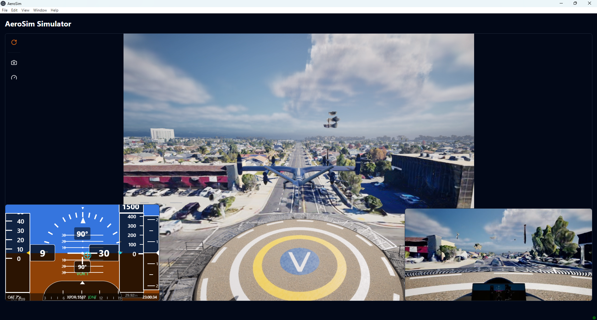

# Autopilot DAA (Detect and Avoid) Scenario Example

This example demonstrates how to use the aerosim package to:

1. Run a simulation with autopilot following predefined waypoints
2. Stream camera images and flight data to the AeroSim app

This example loads waypoints from a file, configures the simulation,
and runs the autopilot in waypoint-following mode.

From the AeroSim root directory:

```sh
cd examples
python autopilot_daa_scenario.py
```

The EVTOL aircraft will take off and follow the waypoints defined in the
mission_waypoints/mission_waypoint_square.txt file under autopilot control.

During the flight, an intruder airplane will fly towards the EVTOL
aircraft to simulate a potential DAA situation. With the AeroSim App window
active you can take manual control to avoid a collision by using an Xbox
controller:

- `B` button activates manual control
- In hover mode (low speed):
    - Left stick controls yaw and altitude
    - Right stick controls forward speed and lateral speed  
- In forward flight mode (high speed):
    - Left stick controls pitch and yaw
    - Right stick controls forward speed and roll
    
Ctrl-C breaks the script to stop the simulation.

