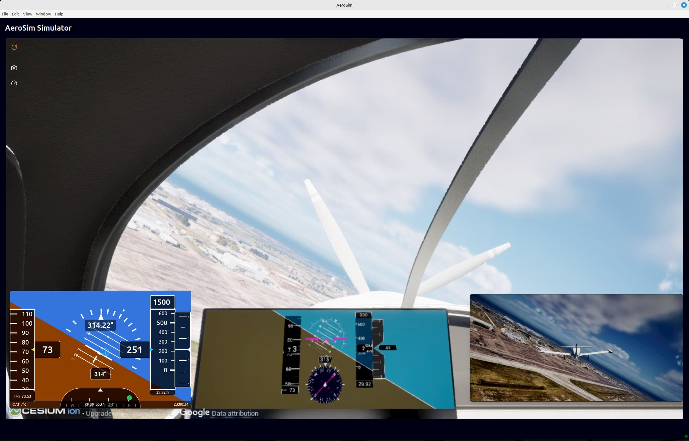

# First Flight with App Example

This example demonstrates how to use the aerosim package to:

1. Run a simulation with WebSockets support for communication with the AeroSim app
2. Process input commands from the AeroSim app
3. Stream camera images and flight data to the AeroSim app

This is a simplified example that shows the core functionality of the aerosim package.

From the aerosim root directory:

```sh
cd examples
python first_flight.py
```

The airplane will take off under autopilot control, but with the AeroSim App window active you 
can use the keyboard to adjust the autopilot setpoints:

- `Up` arrow key increases airspeed setpoint (non-zero setpoint sets throttle to 100%)
- `Down` arrow key decreases airspeed setpoint (zero setpoint sets throttle to 0%)
- `W` key increases altitude setpoint (ascend)
- `S` key decreases altitude setpoint (descend)
- `A` key decreases heading setpoint (turn left)
- `D` key increases heading setpoint (turn right)

Ctrl-C breaks the script to stop the simulation.

