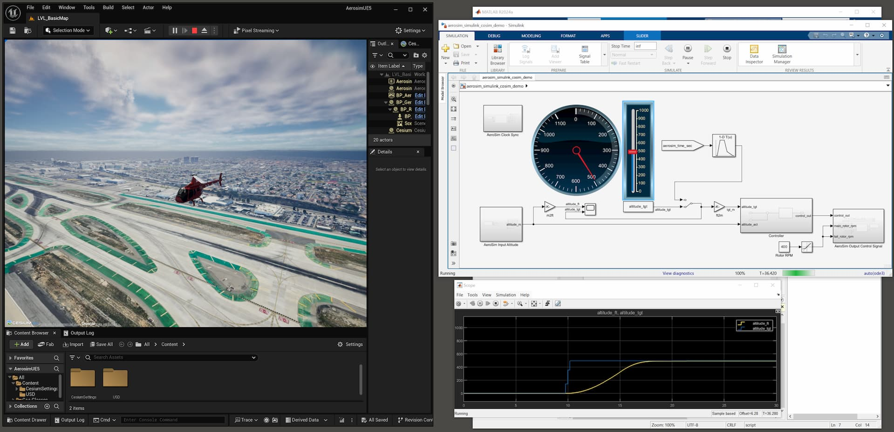

# Simulink Co-Simulation and FMU Example

This example demonstrates how to use the aerosim package to:

1. Run a simulation that co-simulates with [Simulink](https://mathworks.com/products/simulink.html)
2. Stream camera images to the AeroSim app

This example shows how to integrate AeroSim with Simulink models
for advanced control and simulation capabilities.

These are the steps to run this example:

1. See the aerosim-simulink repo's README for how to build the AeroSim S-function
    MEX files. Then from the `aerosim-simulink/examples/` directory, run the
    `load_aerosim_simulink_cosim_demo.m` script in MATLAB to load the example
    Simulink co-sim model.
2. Launch AeroSim and start the selected renderer.
3. Start the Simulink model (the Simulink clock will wait and not start stepping
    until the AeroSim simulation starts running).
4. Run this script to start the AeroSim simulation. The Simulink model should start
    stepping in lock-step with the AeroSim simulation. You can control the altitude
    of the helicopter in the Simulink model using the altitude slider.

Ctrl-C breaks the script to stop the simulation and then the Simulink model should
automatically stop as well.

