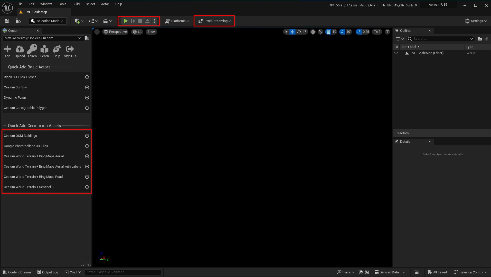
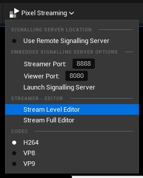
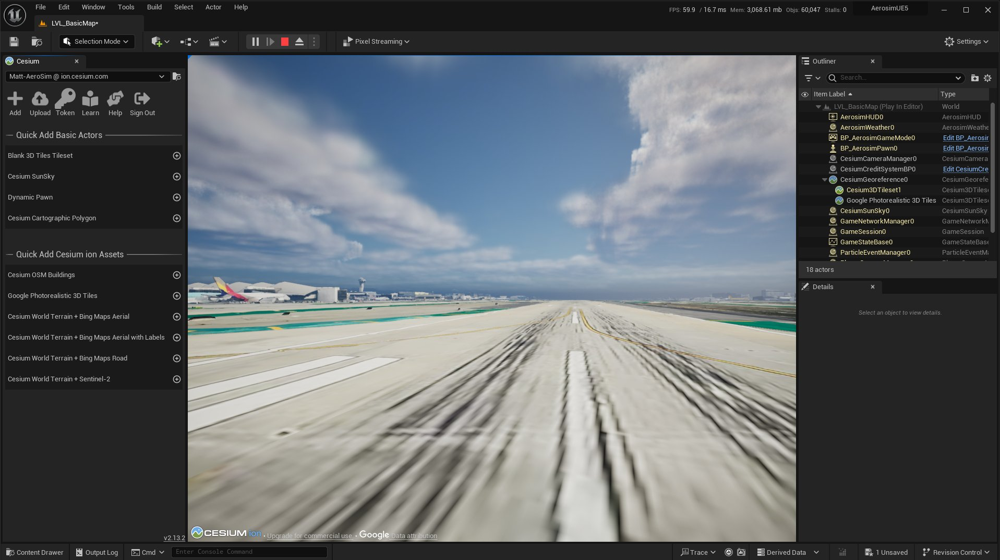

# Running AeroSim simulations

To run simulations in AeroSim, it is necessary to launch several components required by the simulator, prior to launching a simulation script:

* Renderer
* Kafka server
* Orchestrator
* FMU driver

AeroSim provides the `launch_aerosim.sh/bat` script to launch all required components together, there are several options depending upon the desired configuration:

* __--unreal__: launch the Unreal Engine renderer without the editor interface
* __--unreal-editor__: launch the Unreal Engine renderer with the editor interface
* __--unreal-editor-nogui__: launch the Unreal Engine with the editor but without a GUI (for pixel streaming the editor)
* __--omniverse__: launch the Omniverse RTX renderer with the editor interface
* __--pixel-streaming__: launch Unreal Engine or Omniverse with pixel streaming enabled
* __--pixel-streaming-ip__: set the IP address for the pixel stream (default `localhost` or `127.0.0.1`)
* __--pixel-streaming-port__: set the port for the pixel stream (default 80)
* __--help__: information about AeroSim launch options

### Unreal Engine

After launching the Unreal Engine editor, you should see the editor interface with a black viewport:



If you are using Cesium, you should add the type of Cesium asset you want from the *Quick Add Cesium ion Assets* menu, press the circled plus icon to add your chosen asset. In most of our examples and tutorials, *Google Photorealistic 3D Tiles* is a good choice. If you wish to use pixel streaming, open the *Pixel Streaming* dropdown and choose *Stream Level Editor*.



After setting up the Cesium assets, press the green play button in the editor to launch the simulation. You will now see the editor load a Cesium tile or asset:



The renderer is now ready to run a simulation. You can launch an AeroSim simulation using a Python launch script. Activate the AeroSim virtual environment and then launch the script with Python:

```sh
source .venv/bin/activate
cd tutorials/
# Windows .\.venv\Scripts\activate
# Windows cd .\tutorials\

python run_takeoff_tutorial.py
```

Once the simulation is finished, before relaunching the same simulation script (or a new one) it is necessary to stop and restart the simulation in the Unreal Engine editor using the transport controls to clear the scene.


